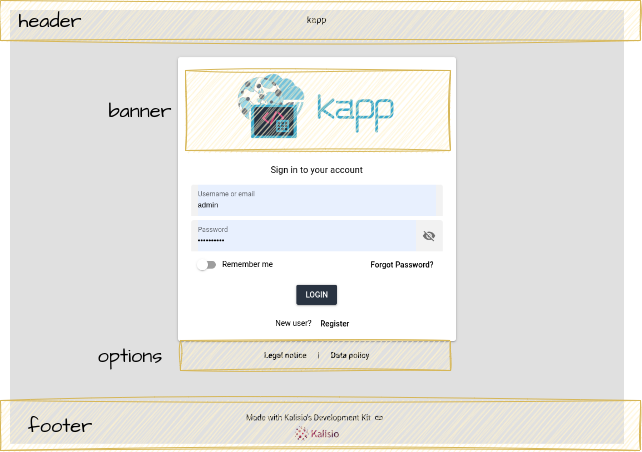

# keycloak-themes

Kalisio's [Keycloak themes](https://www.keycloak.org/docs/latest/server_development/#_themes)

This project brings together a set of Keycloak themes used by Kalisio applications.
Just like the applications developed by Kalisio, these themes are based on the use of the [Quasar Framework](https://quasar.dev/)
This allows to have the same look & feel between the applications and the different user interfaces provided by Keycloak.

> [!Note]
>Before going any further, it is essential to understand how themes work in Keycloak and how one can create a theme. Please refer to the [official documentation](https://www.keycloak.org/docs/latest/server_development/index.html#_themes) and [Apache FreeMarker](https://freemarker.apache.org/index.html).
> You can also read the following articles:
>* [https://trigodev.com/blog/how-to-customize-keycloak-themes](https://trigodev.com/blog/how-to-customize-keycloak-themes)


## Understanding the KDK core theme

The [KDK](./themes/kdk) extends the Keycloak's **base** them with the following types of customization:
* login
 
### Login 

**Login** forms specialize a **FreeMaker** template file, `template.ftl`, that overwrite the default Keycloak `template.ftl` file. It is built on **Quasar Framework** to enable the use of web components to enhance user experience and to simplify the use of Keycloak CSS classes which are not well documented.

The `template.ftl` file extends the Keycloak `template.ftl` by defining 4 **fragments**: 




> [!NOTE]
> Remember that all these fragments are shared by all the different login forms.

> [!TIP]
>Each of these fragments, **header**, **banner**, **options** and **footer**, can be overwritten to fit your needs.

## Extending the KDK theme

### Minimum file stucture

The minimum file structure you need to create is the following:
```
my-theme
 ├ login
 |   └─ resources
 |      ├─ js
 |      |   └─ config.js
 |      └─ img
 |          └─ logo.png
 └─ theme.properties
```

### Internationalization

The **KDK** theme uses the current browser locale and override the **Keycloak** theme locale. You can therefore use FreeMaker's internationalization approach.

#### theme.properties

The [theme.properties](https://www.keycloak.org/docs/latest/server_development/index.html#theme-properties) file allows setting some configuration for the theme.

A **theme.properties** file commonly has content like this

```
parent=kdk 
import=common/keycloak
locales=fr,en
meta=viewport==width=device-width,initial-scale=1
```

#### config.js

The `config.js` file allows you to configurr **Quasar** by defining a [Quasar Config Object](https://quasar.dev/start/umd/#quasar-config-object). 

> [!TIP]
> Use the Quasar Config Object to define the brand colors to be used in the application.

#### logo.png

This file represents the application logo. 

> [!TIP]
> The recommended size is about 400x150 pixels.

### Overwiting fragments

In addition, one can overwrite each fragments to adapt the page to its current need.You just need to add the desired `<fragment>.ftl` file in a `fragments` folder under the `login` folder.

For instance, if you need to overwrite the `options` fragment, add `options.ftl` file as shown below:
```
my-theme
 ├ login
 |   ├─ fragments
 |   |   └─ options.ftl
 |   └─ resources
 |      ├─ js
 |      |   └─ config.js
 |      └─ img
 |         └─ logo.png
 └─ theme.properties
```

### Helper functions

The **KDK** theme comes with an the `popup` function that enables you to display an **HTML** within a popup.

For example, the following lines allow to open the `legal-notice` html file when clicking on the button. In that special case, the complete file name will be resolved according the the locale of the browser:

```html
<q-btn flat label="${msg('legalNotice')}" flat no-caps rounded 
  @click="popup('${msg('legalNotice')}', '${url.resourcesPath}/html/legal-notice_${locale.currentLanguageTag}.html')" 
/>
```

## Checking the theme

To check the theme, we recomend to:

1. create a realm for your application
2. In `Realm Settings`, `Themes` tab, assign the app's theme to the `Login theme`
3. Log in to the app: `https://<keycloak.url>/realms/<app>/account/#/`

> [!NOTE]  
> In local, the url for the `kapp` example will be the following: http://localhost:8080/realms/kapp/account/#/

## Running Keycloak

We provide a generic [Docker compose](https://docs.docker.com/compose/) file to let you run **Keycloak** locally to check your theme.

### Deploying the stack

The **Docker compose** file requires you to define the `POSTGRES_DATA_PATH` which allow to persist the **PostgreSQL** database, such as shown below:

```bash
 export POSTGRES_DATA_PATH=/home/$USER/Volumes/postgres
```

Then you are able to run the stack by typing the following command:

```bash
env UID=${UID} GID=${GID} docker compose -f keycloak-postgres.yml up -d
```

You can now log in to **Keycloak**:
1. Go to http://localhost:8080/
2. Click `Administration Console`
3. Login using the following credentials:
  
  - User: admin
  - Password: Pass;word1

### Removing the stack

To remove the stack, simply type the following command:

```bash
docker compose -f keycloak-postgres.yml down
```
## Contributing

Found a bug ? Missing a Feature ? Want to contribute ? check out our [contribution guidelines](https://kalisio.github.io/kdk/about/roadmap.html#contributing) for details

## License

This project is licensed under the MIT License - see the [license file](./LICENSE) for details

## Authors

This project is sponsored by 

[](https://kalisio.com)


